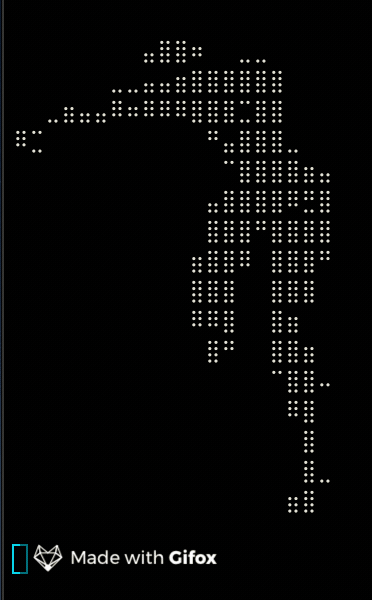
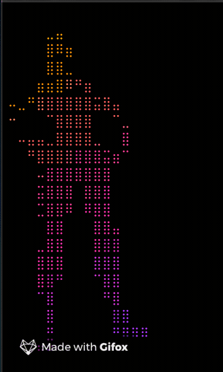

# fndance
You know...the basic, bone-stock, default, noskin dance

Build:
`$ go build -o fndance main.go`

Run:
`$ ./fndance`

Run through lolcat
`$ ./fndance | lolcat`

 

## Even better piped through lolcat https://github.com/busyloop/lolcat

